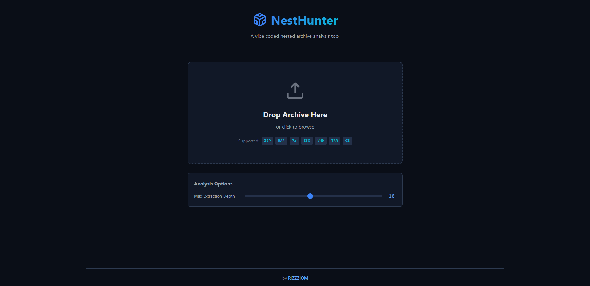
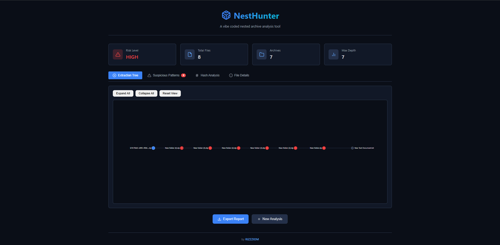
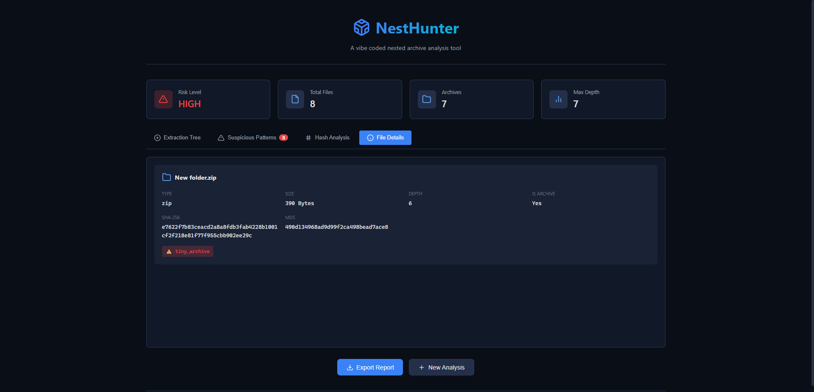

# NESTHUNTER

> **A vibe coded nested archive analysis tool**

NestHunter is a security-focused tool that recursively extracts nested archives (ZIP in ISO in RAR, etc.) and maps the full extraction chain. Detects suspicious nesting patterns commonly used in malware delivery campaigns.

## Features

### Archive Support
- **ZIP** - Standard ZIP archives
- **RAR** - WinRAR archives (requires unrar)
- **7z** - 7-Zip archives
- **ISO** - CD/DVD image files
- **VHD** - Virtual Hard Disk images
- **TAR** - Tape archives
- **GZ/TAR.GZ** - Gzip compressed files

### Security Features
- **Pre-extraction Size Estimation** - Estimates decompressed size before extracting
- **Cumulative Size Limits** - Prevents zip bombs with total extraction limits (default 2GB)
- **Compression Ratio Detection** - Flags ratios >100:1 as potential zip bombs
- **Max Depth Limits** - Prevents zip bomb attacks via deep nesting
- **Hash Tracking** - MD5, SHA1, SHA256 for all files + cross-layer deduplication
- **MIME Type Validation** - Detects mismatches between extension and actual content
- **Single-file Chain Detection** - Flags matryoshka-style archive chains
- **Pattern Analysis** - Identifies malware delivery patterns
- **Risk Scoring** - Automated threat assessment

### Visualization
- **Interactive Tree View** - D3.js powered extraction visualization
- **Drag & Drop Upload** - Easy file analysis
- **Export Reports** - JSON format for further analysis

## Installation

### Prerequisites
- Python 3.8 or higher
- pip (Python package manager)

### Quick Start

- Clone the project

```
git clone https://github.com/phishfolio
cd phishfolio/nesthunter
```

- Create virtual environment (recommended)

```
python -m venv venv

# Activate the virtual environment
# Windows: venv\Scripts\activate
# Linux/macOS: source venv/bin/activate
```

3. Install dependencies

```
pip install -r requirements.txt
```

4. Run the application

```
python nesthunter.py
```

### Additional Requirements

For **RAR** support, install `unrar`:
- **Windows**: Install [WinRAR](https://www.rarlab.com/) or download `unrar.dll`
- **Linux**: `sudo apt-get install unrar`
- **macOS**: `brew install unrar`

## Usage

### Web Interface

1. Start the server:

   ```bash
   python nesthunter.py
   ```

2. Open browser to `http://localhost:5000`



3. Drag and drop an archive or click to browse

4. View the extraction tree and analysis results





### Command Line Options

```shell
$ python .\nesthunter.py -h
usage: nesthunter.py [-h] [--port PORT] [--host HOST] [--debug]

NestHunter - Nested Archive Extraction & Analysis Tool

options:
  -h, --help       show this help message and exit
  --port, -p PORT  Port to run the server on (default: 5000)
  --host, -H HOST  Host to bind to (default: 127.0.0.1, use 0.0.0.0 for all interfaces)
  --debug, -d      Enable debug mode

Examples:
  python nesthunter.py                    # Start server on localhost:5000
  python nesthunter.py --port 8080        # Use custom port
  python nesthunter.py --host 0.0.0.0     # Allow external connections
  python nesthunter.py --debug            # Enable debug mode

Supported Archive Formats:
  ZIP, RAR, 7z, ISO, VHD, TAR, GZ, TAR.GZ
```

## Detected Patterns

### Suspicious Nesting Patterns

| **Pattern**     | **Severity** | **Description**                               |
| --------------- | ------------ | --------------------------------------------- |
| ISO → ZIP       | High         | Common malware delivery via email attachments |
| ISO → RAR       | High         | Bypasses Mark-of-the-Web (MOTW)               |
| VHD → ZIP       | Critical     | Advanced evasion technique                    |
| VHD → RAR       | Critical     | Used in targeted attacks                      |
| ZIP → ZIP → ZIP | Medium-High  | Single-file archive chain                     |

### Zip Bomb Detection

| **Indicator**           | **Threshold** | **Action**             |
| ----------------------- | ------------- | ---------------------- |
| Compression Ratio       | >100:1        | Block extraction       |
| Cumulative Size         | >2GB          | Stop extraction        |
| Pre-extraction Estimate | Exceeds limit | Warning before extract |
| Nested Depth            | >10 levels    | Stop extraction        |

### Malicious Indicators

- **Executable in Archive** - `.exe`, `.dll`, `.scr`, `.bat`, `.ps1`, etc.
- **Extension Masquerading** - `document.pdf.exe`
- **MIME Type Mismatch** - File claims to be ZIP but has different magic bytes
- **Single-file Archive Chains** - Nested single-file containers (matryoshka pattern)
- **Excessive Depth** - More than 5 nested levels
- **Unicode Filename Tricks** - RLO attacks and confusable characters

### Risk Levels

- 🟢 **Clean** - No suspicious patterns
- 🔵 **Low** - Minor indicators
- 🟡 **Medium** - Potentially suspicious
- 🟠 **High** - Likely malicious
- 🔴 **Critical** - Almost certainly malicious

## License

This project is licensed under the MIT License. See the [LICENSE](LICENSE.txt) file for details.

